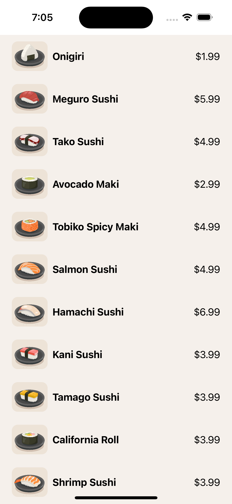

## Swift Coding - Simple Menu App Screen

    This repo contains the code I wrote while learning to make a simple menu app screen with Swift and CodeWithChris.

Course overview

    This course teaches the basics of building iOS apps using Swift and Xcode.

    Arrays, SwiftUI Lists

    HStack, ZStack, VStack
    
    Modifier Positioning
    
    UI Design -> Logic Building -> App Architecture

To run the app code:

    Clone this repo
    Open the Xcode project file
    Build and run the app in a simulator or physical device

Let me know if you have any other questions!
